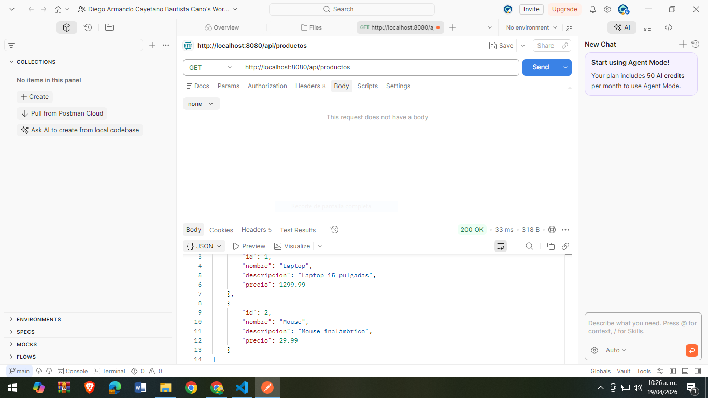
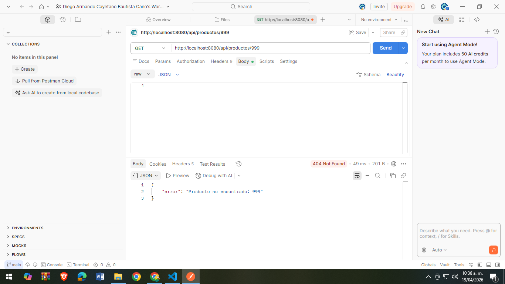
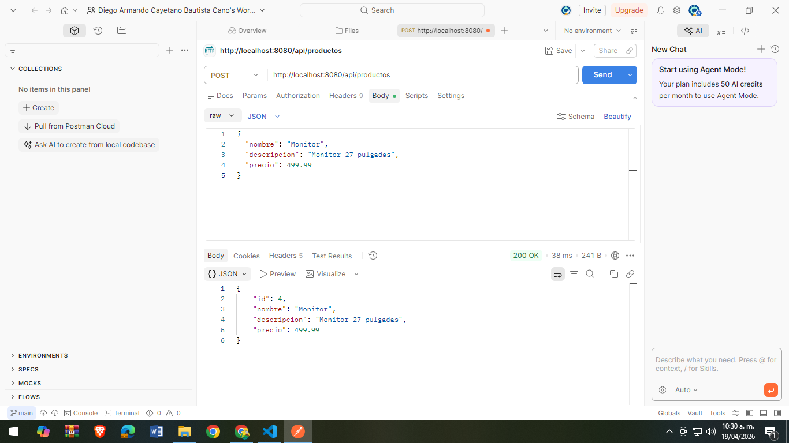
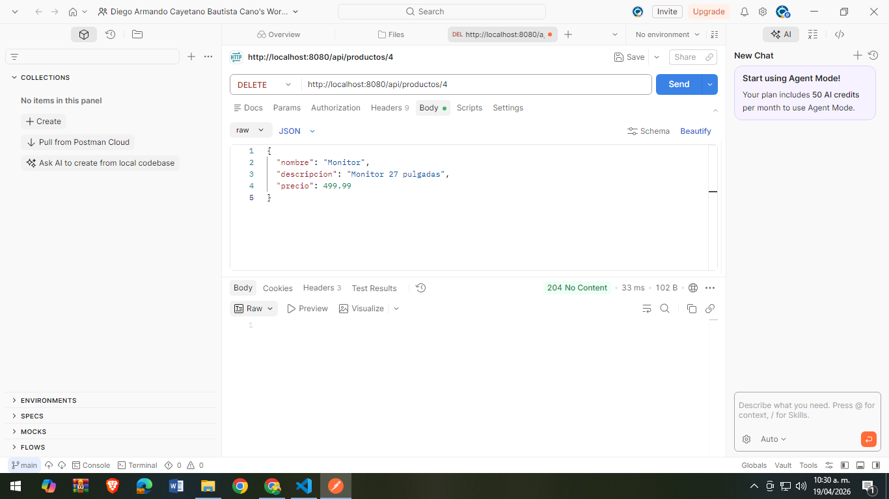

API REST de Productos - Spring Boot
📌 Descripción del Proyecto

Este proyecto consiste en el desarrollo de una API REST utilizando Spring Boot que permite realizar operaciones CRUD (Crear, Leer, Actualizar y Eliminar) sobre una colección de productos en memoria.

La API implementa buenas prácticas del modelo REST, utilizando anotaciones como @RestController y ResponseEntity para manejar correctamente las respuestas HTTP, incluyendo códigos de estado adecuados para cada operación.

Además, se implementa un manejo global de errores con @RestControllerAdvice, permitiendo devolver respuestas en formato JSON cuando un recurso no es encontrado.

⚙️ Tecnologías utilizadas
Java JDK 17+
Spring Boot
Maven
Postman (para pruebas)
🚀 Instrucciones de Ejecución
Clonar el repositorio:
git clone https://github.com/TU_USUARIO/cano-post2-u7.git
Ingresar al proyecto:
cd cano-post2-u7
Ejecutar la aplicación:
mvn spring-boot:run
Acceder a la API desde el navegador o Postman:
http://localhost:8080/api/productos
📡 Endpoints de la API
Método	URL	Descripción
GET	/api/productos	Lista todos los productos
GET	/api/productos/{id}	Obtiene un producto por ID
POST	/api/productos	Crea un nuevo producto
PUT	/api/productos/{id}	Actualiza un producto
DELETE	/api/productos/{id}	Elimina un producto
🧪 Pruebas de la API (Postman)
🔹 Listar productos (GET)

🔹 Obtener producto inexistente (GET 404)

Ejemplo: /api/productos/999

Respuesta:

{
  "error": "Producto no encontrado: 999"
}

## 🧪 Pruebas de la API

### 🔹 GET - Listar productos

---

### 🔹 GET - Producto no encontrado (404)

---

### 🔹 POST - Crear producto

---

### 🔹 PUT - Actualizar producto

---

### 🔹 DELETE - Eliminar producto

❗ Manejo de errores

La aplicación implementa un manejador global de excepciones que retorna respuestas JSON en caso de error, evitando las páginas HTML por defecto de Spring Boot.

Ejemplo:

{
  "error": "Producto no encontrado: 999"
}
👨‍💻 Autor

Diego Armando Cayetano Bautista Cano
